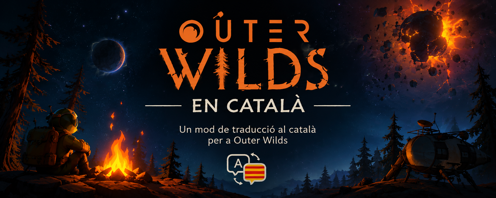

# Traducció al català d'Outer Wilds

Mod que tradueix **Outer Wilds** completament al català, fet amb
[OWML](https://outerwildsmods.com/) i
[Interplanetary Polyglot](https://github.com/xen-42/outer-wilds-localization-utility).
No modifica els fitxers del joc: tot s'instal·la com un mod a `OWML/Mods/`.

## Requisits

- Outer Wilds (versió 1.1.16.1372 o compatible)
- [Outer Wilds Mod Manager](https://outerwildsmods.com/mod-manager/) amb OWML
- El mod **Interplanetary Polyglot** (`xen.LocalizationUtility`), que s'instal·la
  automàticament com a dependència.

## Instal·lació

1. Obre el **Outer Wilds Mod Manager** i instal·la **OWML** si encara no ho has fet.
2. A la pestanya *Mods*, cerca **Catalan Translation** i instal·la'l.
   (Alternativa manual: descomprimeix el `.zip` del mod a la carpeta `OWML/Mods/`.)
3. Comprova que **Interplanetary Polyglot** també està instal·lat.
4. Inicia el joc des del gestor.

## Activar el català

Al joc: **Opcions → Idioma → Català**.

## Estat

- Traducció completa: interfície, registre de bord i diàlegs.
- Qualsevol cadena sense traduir es mostra en anglès.

## Crèdits i avís legal

- Traducció: [davitens](https://github.com/davitens)
- Interplanetary Polyglot: xen-42
- Outer Wilds és propietat de Mobius Digital. Aquest és contingut fet per fans i
  segueix la
  [política de contingut de fans](https://www.mobiusdigitalgames.com/fan-content-policy.html).

## Llicència

[MIT](LICENSE).

## English

A full Catalan translation mod for **Outer Wilds**, built on
[OWML](https://outerwildsmods.com/) and
[Interplanetary Polyglot](https://github.com/xen-42/outer-wilds-localization-utility).
It never touches the game files; everything ships as an OWML mod.

**Install:** get the [Outer Wilds Mod Manager](https://outerwildsmods.com/mod-manager/)
with OWML, install **Catalan Translation** (Interplanetary Polyglot comes as a
dependency), then set **Options → Language → Català**. Untranslated strings fall
back to English. Licensed under MIT; fan content per Mobius Digital's fan content
policy.
